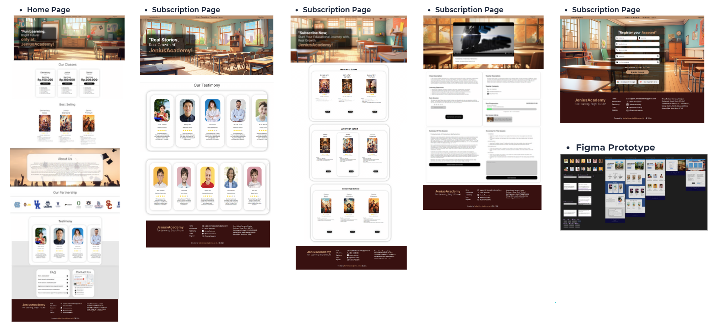

# JeniusAcademy - UI Development

## Project Overview
JeniusAcademy is an online learning application designed to provide an engaging and beneficial learning experience for its users. With the tagline "Fun Learning, Bright Future," the application offers a variety of features across multiple pages, providing a seamless educational experience. This project focuses on building the user interface (UI) using HTML, CSS, and JavaScript based on the following detailed structure:

### Main Features:
- **Home Page**: Displays an overview of subscription services, user testimonials, best-selling courses, information about JeniusAcademy's mission ("About Us"), and its partners. It also includes sections for FAQ and Contact Us for more information.
- **Subscription Page**: Includes the tagline "Subscribe Now, Start Your Educational Journey with Real Growth: JeniusAcademy!" with courses categorized by Elementary School, Junior High School, and Senior High School. Each category offers three subscription options: Basic, Standard, and Premium, including details such as ratings, prices, benefits, and course information. Users can subscribe via the subscription button.
- **Testimony Page**: Showcases real stories of growth through JeniusAcademy with the tagline "Real Stories, Real Growth of JeniusAcademy!" It includes the user's name, course taken, rating, and their comments.
- **Learn Page**: Provides access to course material, including video lessons, class descriptions, learning objectives, and teacher profiles with contact information. Users can rate the session, leave comments, and download exercises and materials. This page also shows the progress of the course and information about upcoming sessions.
- **Register Page**: Contains a registration form where users must provide required details such as first name (without spaces), last name (without spaces), email (must end with "@gmail.com"), phone number (must contain 12 digits), and password (must include uppercase and lowercase letters, numbers, symbols, and no spaces). Password confirmation must match the original password. It also features validation, a "Register" button, and options to log in or continue with Google/Gmail. Once registration is successful, a "Start Explore" button redirects the user to the home page.

## Technologies Used:
- **HTML**: For creating the structure and layout of the pages.
- **CSS**: For styling the pages, ensuring a responsive and visually appealing design.
- **JavaScript**: For adding interactive elements, such as form validation, navigation, and dynamic content display.

## Pages Included:
1. **Home Page**: Overview of services, best-selling courses, testimonials, About Us, FAQ, and Contact Us sections.
2. **Subscription Page**: Displays various subscription options with details and a subscribe button.
3. **Testimony Page**: Displays user testimonials with names, courses, ratings, and comments.
4. **Learn Page**: Provides access to course content, teacher info, session ratings, and downloadable materials.
5. **Register Page**: User registration form with validation and options to log in or register using Google.

## Instructions:
1. **Registration Validation**: Ensure that the registration form fields meet the specific requirements (e.g., 12-digit phone number, valid Gmail address, password rules).
2. **Subscription Options**: Review the subscription page and interact with the course information and subscribe button.
3. **Testimonials**: View user feedback and ratings on the Testimony Page.
4. **Learning Page**: Access course materials and view session progress.

## Credits:
Developed as part of a lab assignment focusing on HTML, CSS, and JavaScript for UI development.

